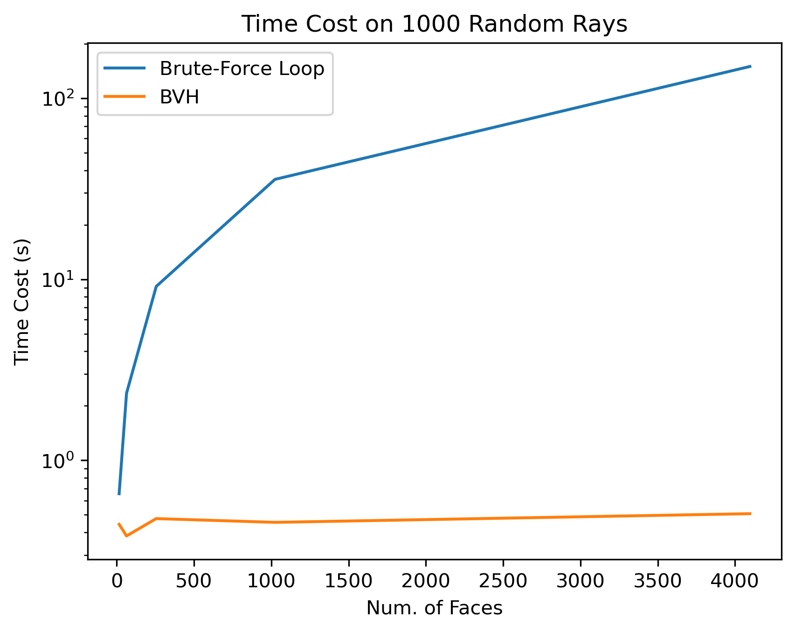
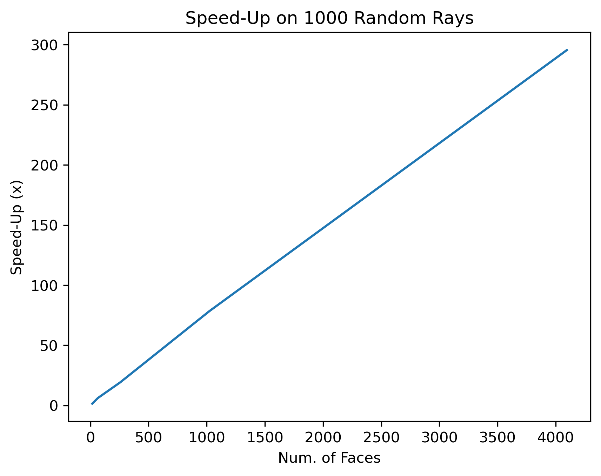

# BVH-python
Python implementation of [BVH](https://en.wikipedia.org/wiki/Bounding_volume_hierarchy) with surface area hierarchy (SAH).

## Dependencies

- numpy
- libigl *(optional, only used in `performance.py` to load mesh)*
- matplotlib *(optional, only used in `performance.py` to plot curves)*

## Usage

Find the following snippet to build a BVH and accelerate ray-casting:

```python
from BVH import Ray, buildBVH

## initialize ray
ray = Ray(origin, direction)

## initialize BVH with vertices and faces
bvh = buildBVH(V, F)

## find intersection
hit, t, idx = bvh.intersect(ray)

## find the face index if ray hits the mesh
if hit:
    faceIdx = bvh.triangles[idx].faceIdx
```

## Performance

To compare the performance between BVH and brute-force loop, simply run the `performance.py`:

```
python performance.py
```

<div align=center>


</div>